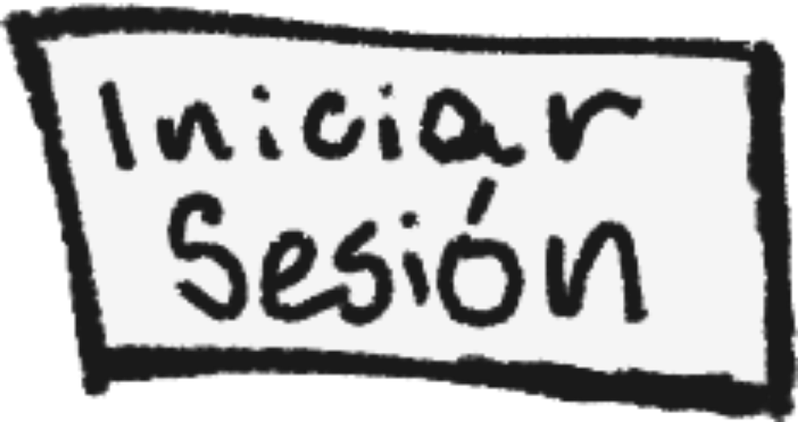
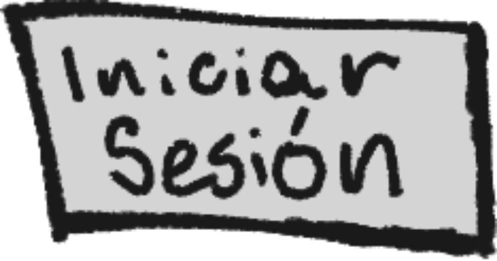

# Waldo_dame_cien_frontend_25-1
Proyecto frontend 25-1

## Descripción del Proyecto
Nuestro proyecto consiste en el desarrollo de un sistema de mensajería instantánea tipo **chatroom**, que permitirá a los usuarios comunicarse en tiempo real dentro de un entorno visual compartido.
A diferencia de los sistemas tradicionales de mensajería, este incluirá una representación gráfica interactiva de una **sala virtual**, en la cual los usuarios estarán representados mediante **avatars tipo stickman**, los cuales podrán ser personalizados según las preferencias individuales de cada usuario.
La finalidad del proyecto es integrar funcionalidad de comunicación en tiempo real con **elementos visuales dinámicos**, promoviendo una experiencia de interacción más **inmersiva y entretenida** para los participantes, con el objetivo de que sea una aplicación ideal para la conexión en un entorno virtual.
Estará principalmente dirigida a **jóvenes adultos y estudiantes** que deseen nuevas formas de interacción en línea.

## Mockups:
* Tendremos 3 vistas principales:
  1. Sala grupal de chat:
  
  Desktop:

  

    

Celular y Tablet

    
    

2. Mensajes directos con amigos:

Desktop:

    

Celular:

    
    

Tablet:

    
    

3. Lista de chats grupales:
Desktop:

    

Celular y Tablet:

    
    

## Logo:

    

## Documento de diseño:

    

    

    

    

* Ejemplos de aplicación: El mejor ejemplo de uso de nuestra paleta de colores se encuentra en los botones de la página.
  

    

    

Por otro lado, las fuentes las usamos alrededor de todo el proyecto. Comic Neue fue usada en los títulos y encabezados, mientras que Comic Sans MS es usada en los "body".

